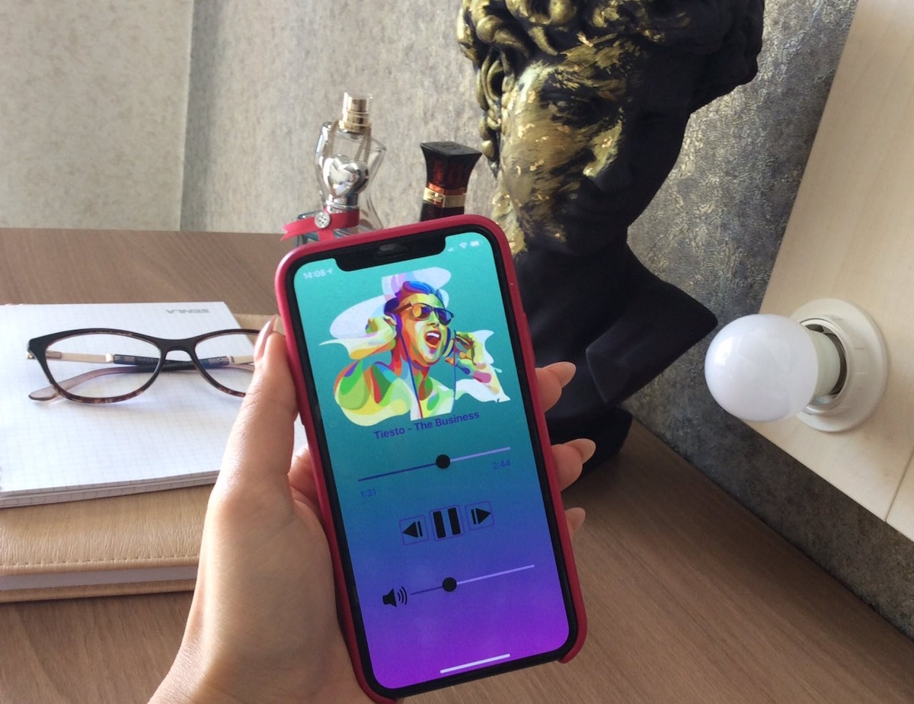
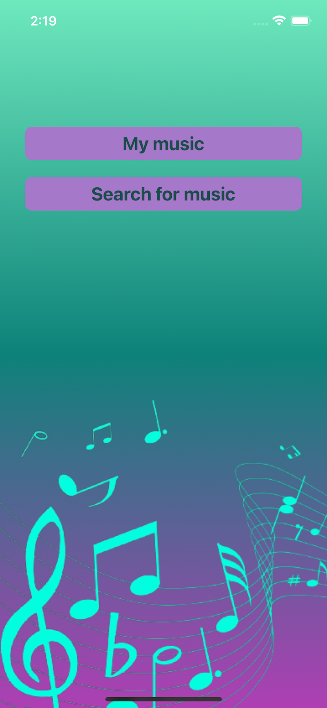
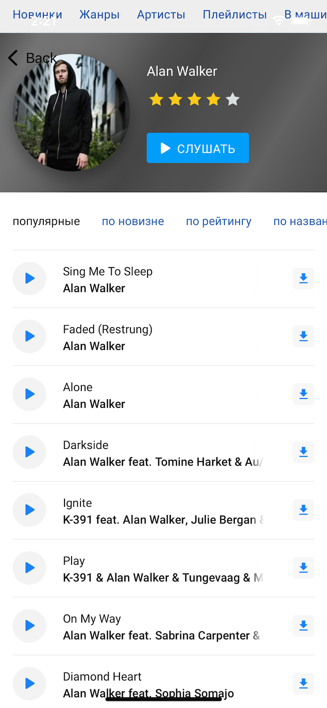
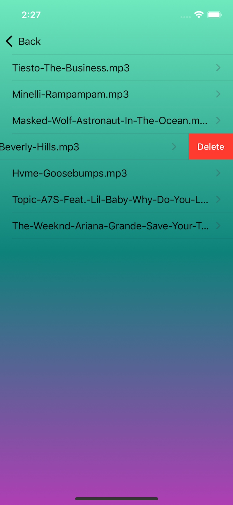
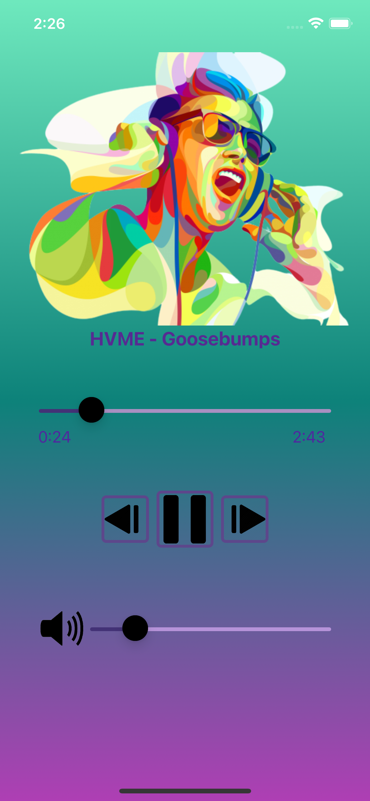
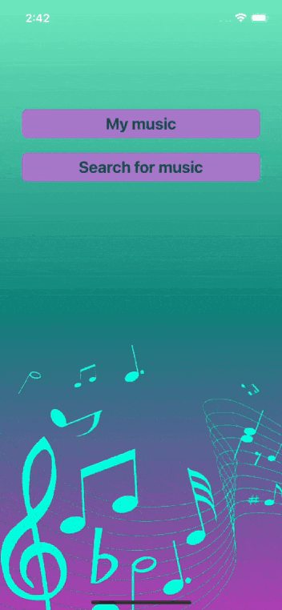

# MUSIC PLAYER - a stylish music player for iOS
MusicPlayer App allows the user to download music from the Internet, to select tracks from the library and play them.  

  
  
## Table of Contents
* [Introduction](#introduction)
* [Requirements](#requirements)
* [Installation](#installation)
* [Technologies](#technologies)
* [Features](#features)
* [Sources](#sources)
* [Contacts](#contacts)

## Introduction
**MusicPlayer** is a vivid audio player developed in Swift. It provides opportunities to download music from the Internet as well as play local bundled files.  

 | 
:-------------------------------------: | :-------------------------------------:
 | 

## Requirements
* Xcode 10.3 or later
* iOS 12.4 or later

## Installation
1. Clone the repository:  
   * using HTTPS:  
`$ git clone https://github.com/milaplatonova/MusicPlayer.git`
    * using SSH:  
`$ git clone git@github.com:milaplatonova/MusicPlayer.git`
1. Add Alamofire as a git submodule:  
`$ git submodule add https://github.com/Alamofire/Alamofire.git`
1. Open the project in Xcode:  
`$ open MusicPlayer.xcworkspace`
1. Choose the **iOS Simulator**, Build and Run the project.

## Technologies
**WebKit**  
MusicPlayer app uses WKWebView to open a web page for downloading tracks from the Internet.  
  
**Alamofire**  
The track's download process is implemented using Alamofire framework.  
  
**FileManager**  
The app uses FileManager to store downloaded tracks and their metadata.  
  
**AVFoundation**  
A class AVPlayer of AVFoundation framework is used to play media assets. It allows to manage the playback and timing of a track.  
  
**Timer**  
Timer is used to observe a track's playback time as it progresses to update the playback position and synchronize the state of user interface objects.  
  
**GCD**  
The app uses an asynchronous dispatch queue to execute tasks related to the player interface adjustment.  
  
**Notification Center**  
When AVPlayer finishes to play a track, NotificationCenter enables the broadcast of this information in order to start the playback of the next track and adjust the necessary parameters.  
  
**Gesture Recognizer**  
UISwipeGestureRecognizer is used to dissmiss the player and return back to the playlist.

## Features
* iPhone and iPad realization
* portrait & landscape mode
* bright design
* music downloading
* deleting files
* playing music with the following options:  
  :arrow_forward: - play  
  :pause_button: - pause  
  :next_track_button: - next track  
  :previous_track_button: - previous track  
* music progress with time indicators
* music rewind
* volume control, includind mute option
* swipe gestures to close the player
* background mode  
  

  
## Sources
To download music MusicPlayer app uses the [Drivemusic](https://drivemusic.me) website.  
  
## Contacts
Lyudmila Platonova  
:email: milaplatonova@icloud.com  
:bust_in_silhouette: [LinkedIn](https://www.linkedin.com/in/lyudmilaplatonova/)
